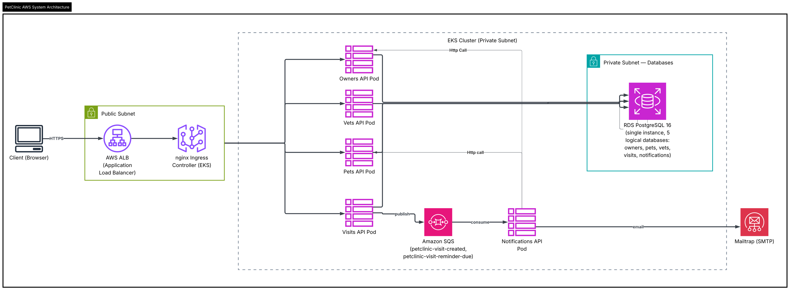
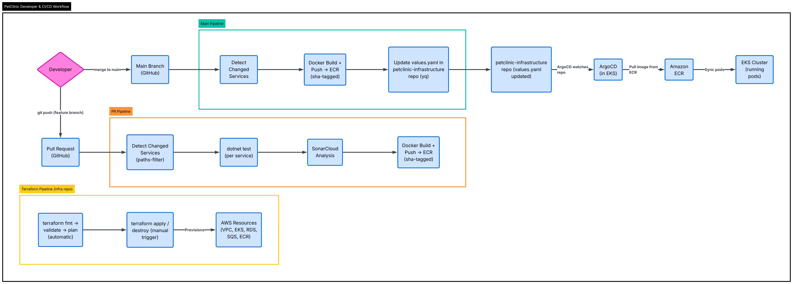

# PetClinic Platform

A microservices-based veterinary clinic management system built with ASP.NET Core and React, deployed to AWS EKS using a GitOps pipeline.

---

## Repositories

The project is split across two repositories following infrastructure-as-code separation of concerns:

| Repository | Purpose |
|---|---|
| [`petclinic-platform`](https://github.com/misha709/petclinic-platform) *(this repo)* | Application source code, Dockerfiles, CI/CD pipelines (PR + Main), frontend |
| [`petclinic-infrastructure`](https://github.com/misha709/petclinic-infrastructure) | Terraform (AWS), Helm charts, ArgoCD manifests, Ansible playbooks |

---

## Architecture at a Glance



```
Browser / Client
      │
      ▼
  nginx Gateway  (:8080)
      │
      ├──► Owners API   ──► PostgreSQL (owners DB)
      ├──► Pets API     ──► PostgreSQL (pets DB)
      ├──► Vets API     ──► PostgreSQL (vets DB)
      ├──► Visits API   ──► PostgreSQL (visits DB)  ──► Amazon SQS
      ├──► Notifications API ──► Amazon SQS (consumer)
      │                         ──► SMTP / Amazon SES
      └──► React Frontend (served via nginx)
```

All services communicate over HTTP within a shared Docker network (local) or Kubernetes cluster (production). The Visits service publishes events to **Amazon SQS** (via MassTransit); the Notifications service consumes them and sends emails.

---

## Services

| Service | Stack | Responsibilities |
|---|---|---|
| **Gateway** | nginx | Route all client traffic to services, CORS, SSL termination |
| **Owners API** | ASP.NET Core 10 | CRUD for clinic owners |
| **Pets API** | ASP.NET Core 10 | CRUD for pets, linked to owners |
| **Vets API** | ASP.NET Core 10 | CRUD for veterinarians and specializations |
| **Visits API** | ASP.NET Core 10 | Schedule/cancel appointments, publish SQS events |
| **Notifications API** | ASP.NET Core 10 | Consume SQS events, send email notifications |
| **Frontend** | React + Vite + TypeScript + Tailwind | Clinic staff UI |

Each backend service follows clean architecture: `Api → Application → Domain ← Infrastructure`.

---

## Tech Stack

**Application**
- ASP.NET Core 10 (.NET 10)
- Entity Framework Core + PostgreSQL 16
- MassTransit + Amazon SQS (messaging)
- React 18, TypeScript, Vite, Tailwind CSS, shadcn/ui

**Local Development**
- Docker Compose (all services + databases + LocalStack + Mailpit)
- LocalStack — emulates AWS SQS/SNS locally
- Mailpit — captures outgoing emails in a local web UI

**CI/CD**
- GitHub Actions (PR pipeline + Main pipeline)
- SonarCloud (static analysis)
- Amazon ECR (container registry)
- ArgoCD (GitOps deployment to EKS)

**Infrastructure (petclinic-infrastructure repo)**
- Terraform — VPC, EKS, RDS PostgreSQL, ECR, SQS, IAM, CloudWatch
- Helm — Kubernetes manifests for all services
- Ansible — Tooling VM provisioning (kubectl, helm, argocd CLI)
- S3 — Terraform remote state backend

**Cloud (AWS)**
- EKS (Kubernetes cluster)
- RDS PostgreSQL 16
- Amazon SQS
- Amazon ECR
- CloudWatch Container Insights

---

## Repo Structure

```
petclinic-platform/
├── .github/
│   └── workflows/
│       ├── pr.yml          # PR pipeline: test, sonar, build+push SHA image
│       └── main.yml        # Main pipeline: build+push, update infra values.yaml
├── docs/
│   ├── Readme.md
│   ├── requirements.md
│   └── .plan.md
├── scripts/
│   └── bump_version.py     # SemVer auto-tagging
└── src/
    ├── PetClinic.sln
    ├── docker-compose.yml
    ├── backend/
    │   ├── gateway/        # nginx.conf
    │   ├── owners/         # Owners microservice
    │   ├── pets/           # Pets microservice
    │   ├── vets/           # Vets microservice
    │   ├── visits/         # Visits microservice
    │   └── notifications/  # Notifications microservice
    ├── frontend/
    │   └── web/            # React app (Vite + Tailwind + shadcn/ui)
    └── db-seeds/           # SQL seed data

petclinic-infrastructure/
├── terraform/
│   ├── bootstrap/          # S3 state bucket (run once)
│   ├── modules/            # vpc, eks, ecr, rds, sqs, iam, cloudwatch
│   └── environments/dev/   # Root module wiring all modules
├── helm/petclinic/         # Helm chart for all services
├── argocd/apps/            # ArgoCD Application manifest
├── ansible/                # Tooling VM playbook
└── .github/workflows/
    └── terraform.yml       # fmt → validate → plan → apply/destroy
```

---

## CI/CD Pipelines



### PR Pipeline (`.github/workflows/pr.yml`)

Runs on every pull request.

| Step | Description |
|---|---|
| Detect changes | `dorny/paths-filter` — determines which services changed |
| Test | `dotnet test` per changed backend service |
| Build (web) | `npm ci && npm run build` if frontend changed |
| SonarCloud | Full solution scan on every PR |
| Build + push | Docker image tagged `sha-<commit>` pushed to ECR (changed services only) |

### Main Pipeline (`.github/workflows/main.yml`)

Runs on every merge to `main`.

| Step | Description |
|---|---|
| Detect changes | Same paths-filter logic |
| Build + push | Docker image tagged with short commit SHA pushed to ECR |
| Update infra | Commits updated image tags to `petclinic-infrastructure/helm/petclinic/values.yaml` via `yq` |
| ArgoCD sync | ArgoCD detects the `values.yaml` commit and auto-syncs the EKS cluster |

### Terraform Pipeline (`petclinic-infrastructure` repo)

| Stage | Trigger |
|---|---|
| `terraform fmt -check` | Automatic |
| `terraform validate` + `plan` | Automatic |
| `terraform apply` | Manual (`workflow_dispatch`) |
| `terraform destroy` | Manual (`workflow_dispatch`) |

---

## Running Locally

**Prerequisites:** Docker Desktop, Docker Compose

```bash
git clone https://github.com/misha709/petclinic-platform
cd petclinic-platform/src
docker compose up --build
```

| Service | URL |
|---|---|
| Frontend + Gateway | http://localhost:8080 |
| Mailpit (email UI) | http://localhost:8025 |
| Owners API | http://localhost:5080 |
| Pets API | http://localhost:5081 |
| Vets API | http://localhost:5082 |
| Visits API | http://localhost:5083 |
| Notifications API | http://localhost:5084 |
